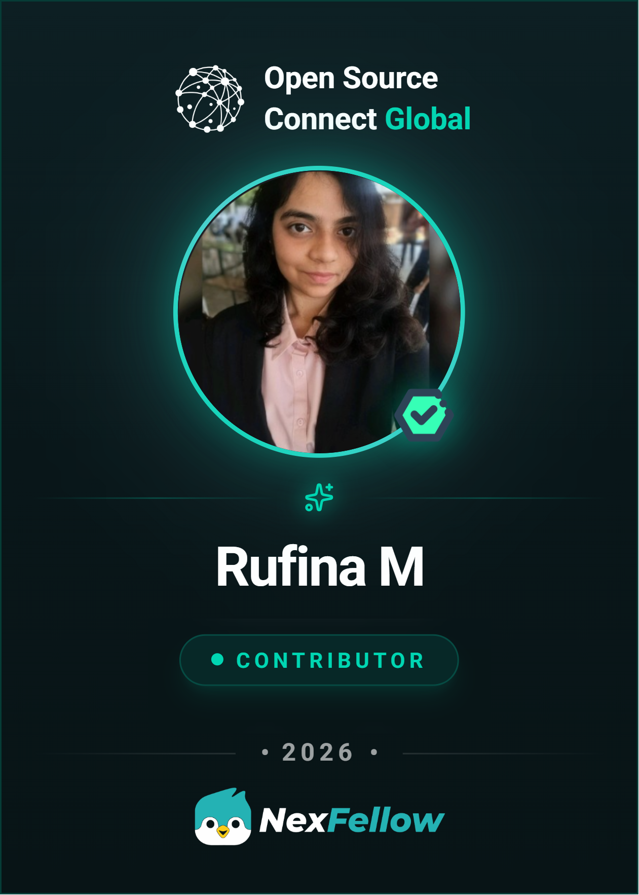

# Hi, I'm Rufina 👋  

### AI • Backend • Cloud • Full-Stack Projects  

I build practical software ideas — from AI/ML experiments and LLM APIs  
to backend systems, cloud deployments, and working project demos.

Learning by building, breaking, fixing, and shipping.

## About Me

I'm a final-year Integrated M.Tech CSE student interested in building useful, real-world software systems.  
My work usually sits around **AI applications, backend development, cloud deployment, and data-driven systems**.

I enjoy taking rough ideas and turning them into working prototypes with clean documentation and practical demos.

## Tech Stack

### Programming & Backend

### Frontend & Full Stack

### AI, LLM & Data

### Databases & Tools

## AWS Services I Have Worked With

I have worked with AWS services through backend/API deployment, authentication, storage, container registry, access management, and cloud-based project demos.

<a href="https://drive.google.com/file/d/1m_mwe-mrylXfqPlBRqGWSH1EfyPeBabX/view?usp=drive_link">View AWS / Cloud Experience Letter</a>

## Trying Out the Basics

Currently learning the basics of LLMOps, Kubernetes, Prometheus, and Grafana to better understand deployment, monitoring, and production-ready AI systems.

## Badges & Recognition

  

## Open Source Journey

I’m starting to explore open-source work — learning how real projects are built, how contributors collaborate, and how to make meaningful contributions step by step.

### Building at the intersection of curiosity, passion, and impact!

